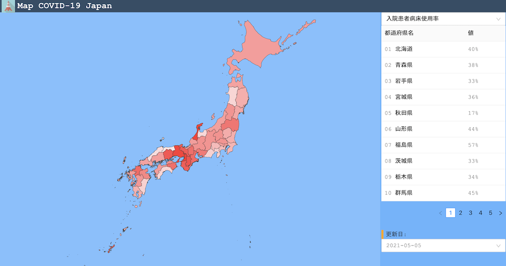

# map-covid-japan

Map based visualization site of COVID-19 in Japan. This site is using open data provided by government in Japan. For details about data, see [refs](#refs).



https://map-covid.kokutele.com/

## how to dev

```
$ npm start
```

## refs

* [COVID-19 Japan 新型コロナウイルス対策ダッシュボード](https://www.stopcovid19.jp/)
* [【厚生労働省】療養状況等及び入院患者受入病床数等に関する調査について](https://www.mhlw.go.jp/stf/seisakunitsuite/newpage_00023.html)
* [Data of Japan](https://github.com/dataofjapan/land)
